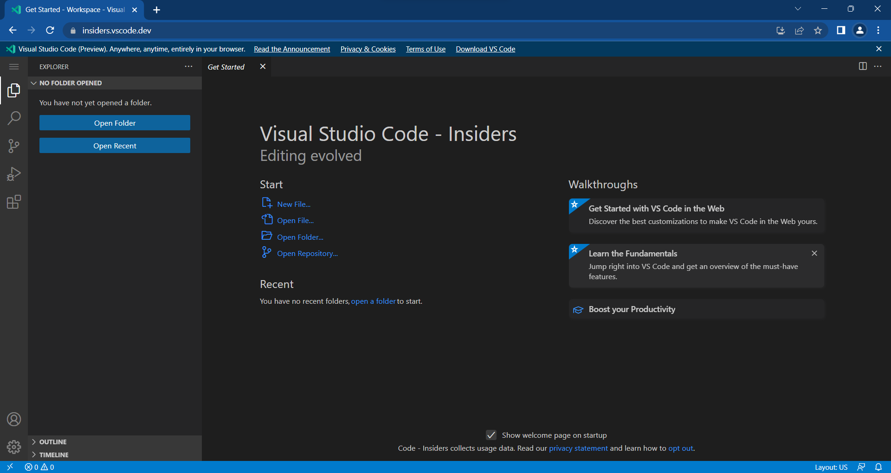
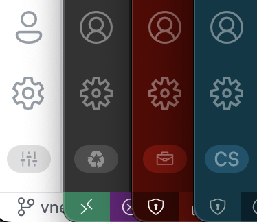
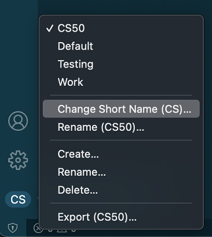
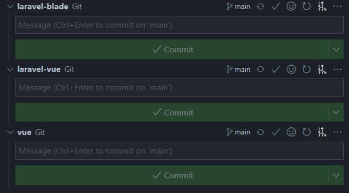
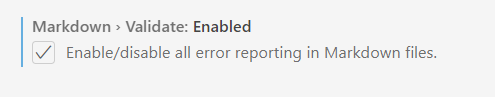

## 1. update highlight vscode 1.72

Source:

- [Update Note](https://code.visualstudio.com/updates/v1_72)
- [Release Party (video penjelasan update 1.72)](https://www.youtube.com/watch?v=mllbWOxbb-g&t=33s&ab_channel=VisualStudioCode)
  
## 1.a vscode web

[vscode web](https://insiders.vscode.dev/)<br>
[install chrome extension](https://chrome.google.com/webstore/detail/vs-code/kobakmhnkfaghloikphojodjebdelppk?hl=en)

**Screenshot**



## 1.b Settings Profiles
- open: ```File>Freferences>Settings``` or shorcut: ```ctrl + ,```
- paste in Search Settings ```workbench.experimental.settingsProfiles.enabled```

**VSCode Profiles**



**Profiles Settings**



## 1.c Nested Git Repositories

- open: ```File>Freferences>Settings``` or shorcut: ```ctrl + ,```
- ```git.repositoryScanMaxDepth``` setting (the default is 1 level)
    

## 1.d Markdown Link Validation

- open: ```File>Freferences>Settings``` or shorcut: ```ctrl + ,```
- paste in Search Settings ```markdown validate```
- enable markdown validate
    

# 2Pemrograman Dasar PHP

sumber:
[w3schools](https://www.w3schools.com/php/default.asp)

## 2.a Basic Syntax

**contoh 1**
```php
<?php
// PHP code goes here
?>
```

**contoh 2**
```php
<!DOCTYPE html>
<html>
<body>

<h1>My first PHP page</h1>

<?php
echo "Hello World!";
?>

</body>
</html>
```

**contoh 3**
```php
<html>
<body>

Welcome <?php echo $_POST["name"]; ?><br>
Your email address is: <?php echo $_POST["email"]; ?>

</body>
</html>
```
## 2.b Comments
```php
<?php
// This is a single-line comment

# This is also a single-line comment
?>
```
```php
<?php
/*
This is a multiple-lines comment block
that spans over multiple
lines
*/
?>
```
## 2.c Variable
```php
<?php
$txt = "Hello world!";
$x = 5;
$y = 10.5;
?>
```
## 2.d Data Types

Variabel bisa menyimpan data dengan type yang berbeda dan type data memiliki fungsi yang berbeda-beda.

PHP mendukung type data sebagai berikut:

- String
- Integer
- Float (floating point numbers - also called double)
- Boolean
- Array
- Object
- NULL
- Resource


## 2.e Operators

[https://www.w3schools.com/php/php_operators.asp](https://www.w3schools.com/php/php_operators.asp)

## 2.f Percabangan

[https://www.w3schools.com/php/php_looping.asp](https://www.w3schools.com/php/php_looping.asp)

## 2.g Perulangan

[https://www.w3schools.com/php/php_looping.asp](https://www.w3schools.com/php/php_looping.asp)

## 2.h Fungsi

[https://www.w3schools.com/php/php_functions.asp](https://www.w3schools.com/php/php_functions.asp)


