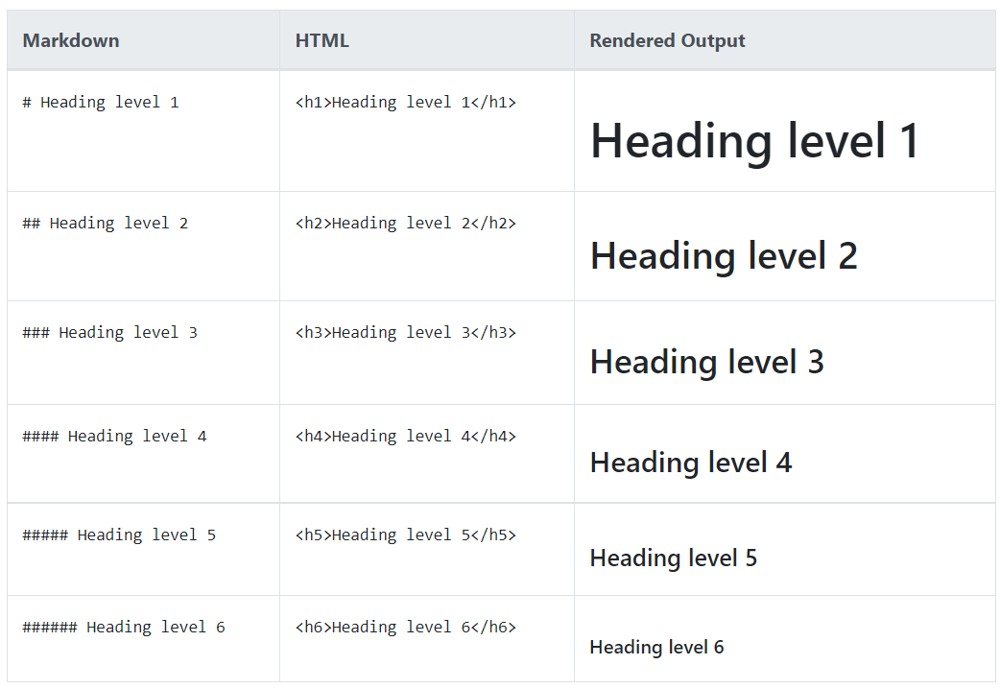
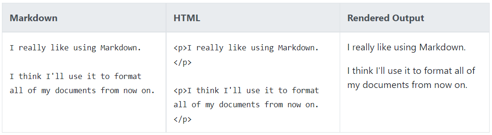
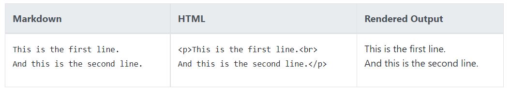
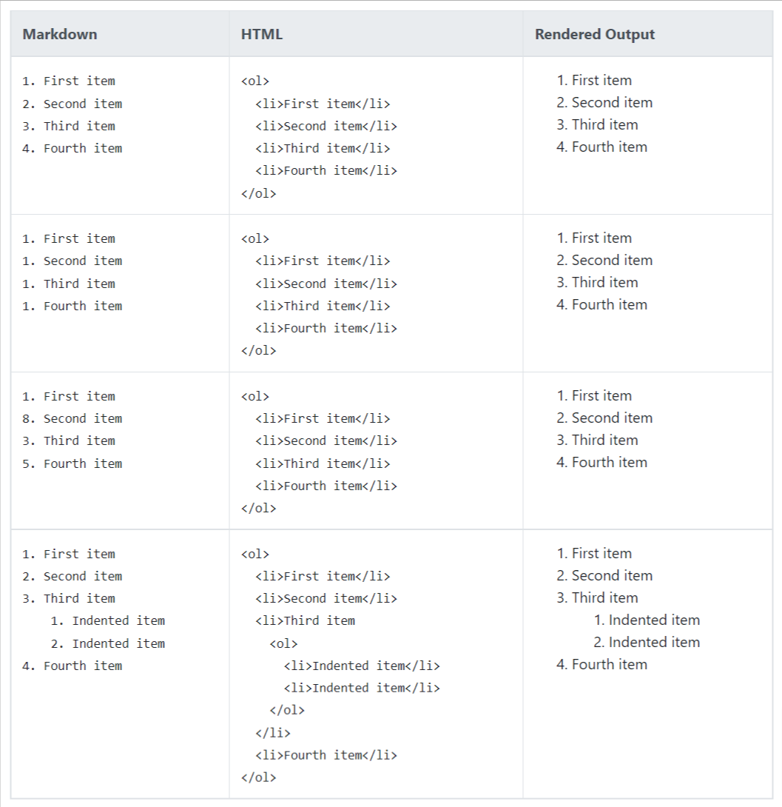
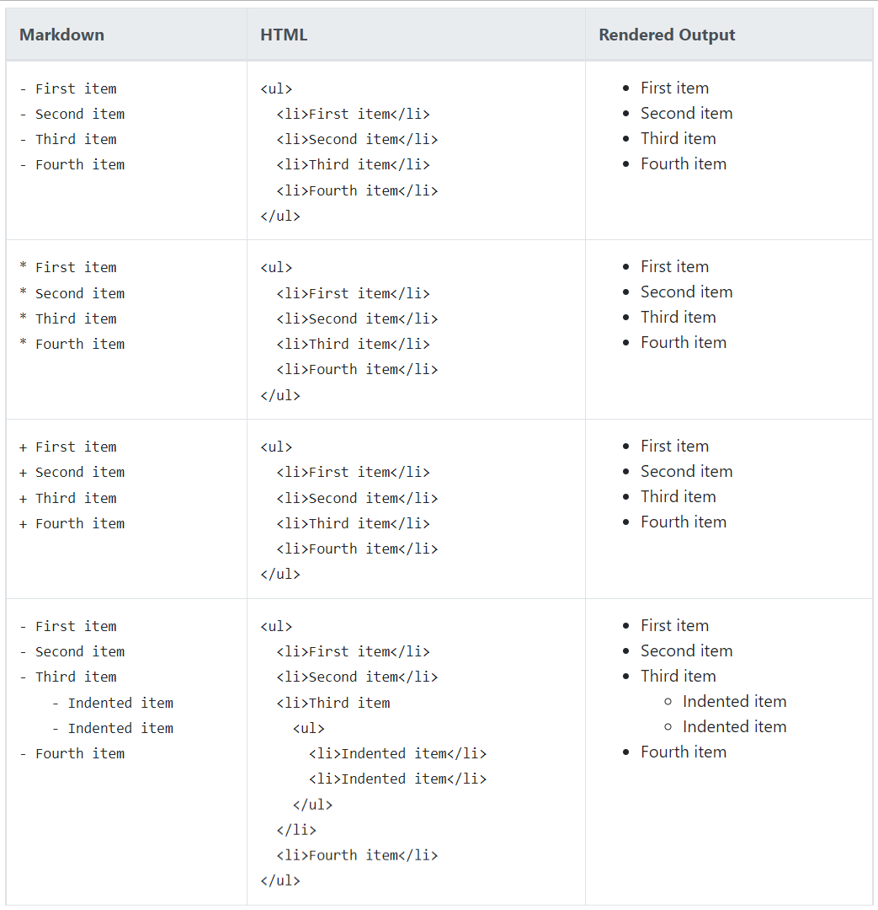
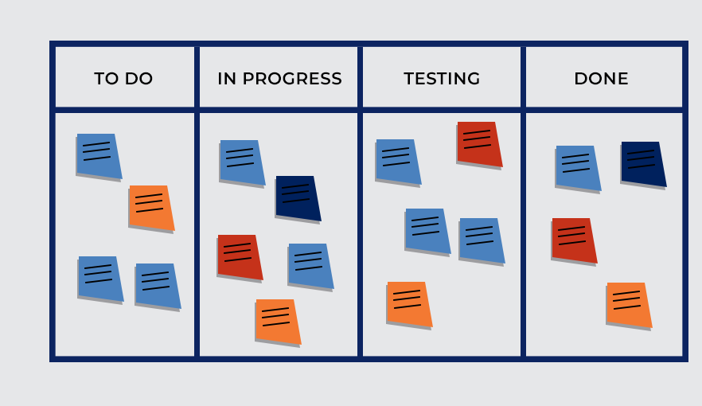
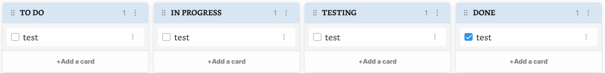

## A. Markdown I (Basic Syntax)

Learn Markdown in 1 Minutes: [https://www.youtube.com/shorts/4z0l5Kl2Q6E](https://www.youtube.com/shorts/4z0l5Kl2Q6E)

Source:

- [https://www.markdownguide.org/](https://www.markdownguide.org/)
- [https://www.markdownguide.org/basic-syntax/](https://www.markdownguide.org/basic-syntax/)
- ~~[https://www.markdownguide.org/extended-syntax/](https://www.markdownguide.org/extended-syntax/) (Later in Markdown II)~~


### A.1 Heading

Untuk membuat Heading, gunakan symbol (#) didepan kata atau judul, Jumlah banyaknya symbol (#) akan menyesuaikan dengan level dari heading.



<!-- Contoh:
# Heading 1
## Heading 2
### Heading 3
#### Heading 4
##### Heading 5
###### Heading 6 -->


### A.2 Paragraphs


Untuk membuat paragraph, gunakan garis baru untuk memisahkan paragraph text.



<!-- Contoh:

Lorem ipsum dolor sit amet, consectetur adipiscing elit, sed do eiusmod tempor incididunt ut labore et dolore magna aliqua. Ut enim ad minim veniam, quis nostrud exercitation ullamco laboris nisi ut aliquip ex ea commodo consequat. 

Duis aute irure dolor in reprehenderit in voluptate velit esse cillum dolore eu fugiat nulla pariatur. Excepteur sint occaecat cupidatat non proident, sunt in culpa qui officia deserunt mollit anim id est laborum. -->

### A.3 Line Breaks (Garis Baru)

```<br>```



### A.4 Emphasis (Bold, Italic, Bold & Italic)

|Emphasis|Syntax|Contoh|
|--|--|--|
|Italic|`*`|Italicized text is the *cat's meow*.|
|Bold|`**`|I just love **bold text**.|
|Bold & Italic|`***`|This text is ***really important***.|

<!-- Contoh

Italicized text is the *cat's meow*.

I just love **bold text**.

This text is ***really important***. -->

### A.5 Lists

#### A.5.1. Ordered Lists
Untuk membuat list berurutan, tambahkan item baris dengan angka diikuti dengan titik. Nomor tidak harus dalam urutan numerik, tetapi list harus dimulai dengan nomor satu.



<!-- Contoh:

1. First item
2. Second item
3. Third item
4. Fourth item -->

### A.5.2. Unordered Lists
Untuk membuat list yang tidak berurutan, tambahkan tanda kurang (-), tanda bintang (*), atau tanda tambah (+) di depan item baris. Indentasi satu atau beberapa item untuk membuat nested-list.



<!-- Contoh:

- First item
- Second item
- Third item
- Fourth item -->

### A.6 Code Blocks

`sample` <br>
``sample`` <br>

```
{
  "firstName": "John",
  "lastName": "Smith",
  "age": 25
}
```
Syntax Highlighting Example

```json
{
  "firstName": "John",
  "lastName": "Smith",
  "age": 25
}
```

```csharp
// Hello World! program
namespace HelloWorld
{
    class Hello {         
        static void Main(string[] args)
        {
            System.Console.WriteLine("Hello World!");
        }
    }
}
```

### A.7 Links
Untuk membuat link, lampirkan teks tautan dalam tanda kurung siku (mis., [Duck Duck Go]) lalu segera ikuti URL dalam tanda kurung (mis., (https://duckduckgo.com)).

contoh

My favorite search engine is [Duck Duck Go](https://duckduckgo.com).

### A.8 Images
Untuk menambahkan gambar, tambahkan tanda seru (!), diikuti oleh alt-text dalam tanda kurung, dan tambahkan path atau URL ke aset gambar dalam tanda kurung. Anda dapat secara opsional menambahkan judul dalam tanda kutip setelah path atau URL.

Contoh:


## B. MKDocs

Dokumentasi [https://www.mkdocs.org/getting-started/](https://www.mkdocs.org/getting-started/)

### B.1 Install Python & MKdocs

1. Install Python: [https://www.python.org/](https://www.python.org/)
2. Install Mkdocs
```bash
pip install mkdocs
```

### B.2 Membuat Project MKdocs

1. Jalankan perintah berikut di terminal
```bash
mkdocs new nama-project
```
2. Lalu masuk ke direktori project
```bash
cd nama-project
```

### B.3 Menjalankan Project

1. Jalankan perintah berikut di terminal
```bash
mkdocs serve
```

### B.4 Mengganti Thema

Thema MKdocs: [https://github.com/mkdocs/mkdocs/wiki/MkDocs-Themes](https://github.com/mkdocs/mkdocs/wiki/MkDocs-Themes)

1. Install Thema yang dipilih
2. Ganti Thema di file config

```yml
site_name: My Docs
theme:
  name: material
```

### B.5 Deploy Project MKdocs

1. Buat Repository di Github
2. Upload Project Ke Github 
```bash
git init
git add .
git commit -m "first-commit"
git remote add origin alamat-repo
git branch -M main
git push -u origin main
```
3. Generate MKdocs Project Pages
   
```bash
mkdocs gh-deploy
```


## C. Obsidian I (Kanban Exntensions)

[Github Repo: obsidianmd/obsidian-sample-plugin](https://github.com/mgmeyers/obsidian-kanban)



Kanban Obsidian

