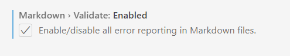

# update highlight vscode 1.72

Source:

- [Update Note](https://code.visualstudio.com/updates/v1_72)
- [Release Party (video penjelasan update 1.72)](https://www.youtube.com/watch?v=mllbWOxbb-g&t=33s&ab_channel=VisualStudioCode)
  
## vscode web

[vscode web](https://insiders.vscode.dev/)<br>
[install chrome extension](https://chrome.google.com/webstore/detail/vs-code/kobakmhnkfaghloikphojodjebdelppk?hl=en)

**Screenshot**


## Settings Profiles
- open: ```File>Freferences>Settings``` or shorcut: ```ctrl + ,```
- paste in Search Settings ```workbench.experimental.settingsProfiles.enabled```

**VSCode Profiles**


**Profiles Settings**


## Nested Git Repositories

- open: ```File>Freferences>Settings``` or shorcut: ```ctrl + ,```
- ```git.repositoryScanMaxDepth``` setting (the default is 1 level)
    

## Markdown Link Validation

- open: ```File>Freferences>Settings``` or shorcut: ```ctrl + ,```
- paste in Search Settings ```markdown validate```
- enable markdown validate
    
